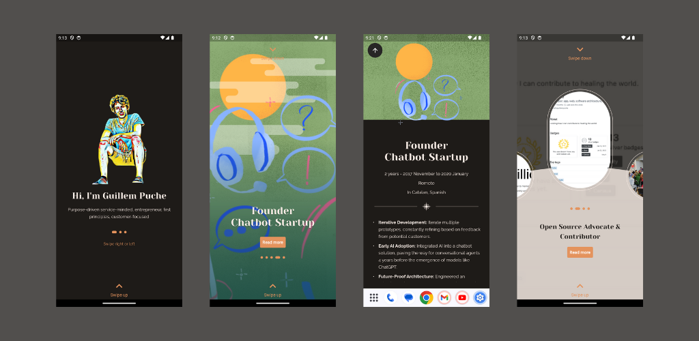

# Guillem Currriculm App



## Play with the app and web

<a href="https://play.google.com/store/apps/details?id=com.guillempuche.guillem_curriculum">
  
</a>
<a href="">
  
</a>

Website: [https://curriculum.guillempuche.com/](https://curriculum.guillempuche.com/)

## Getting started with the code

Built with Flutter 3.10.6. Check out [here](https://docs.flutter.dev/release/archive) all the versions

Run the app:

1. Install the project packages `flutter pub get`.
2. Open a simulators (iOS, Android or Chrome) or real device.
3. Run the app `flutter run -d <your_simulator_id_or_device_id>`

> If you want to use multiple languages (half implemented), use `flutter run` will automatically generated [translations](https://docs.flutter.dev/accessibility-and-localization/internationalization).

## Deploy on web

1. Copy `main` branch to a new branch, e.g. `web-new`.
2. Run `flutter build web` or `flutter build web --release` to make the size smaller.
3. Setup Github Actions to auto deployment as Github Page, for more look at this project branch `web`, folder `/.github/workflows/actions.yml`.
4 We only want the build directory of this branch on Github to then be hosted on Github Pages. We want to ignore the git publishing of the rest of the files in this branch. Replace `/.gitignore` for this:

```
*
lib/
test/
web/

# Flutter/Dart/Pub related
**/doc/api/
**/ios/Flutter/.last_build_id
.dart_tool/
.flutter-plugins
.flutter-plugins-dependencies
.packages
.pub-cache/
.pub/
/build/**
!/build/web/
!/build/web/**

# Miscellaneous
*.class
*.log
*.pyc
*.swp
desktop.ini
.DS_Store
.atom/
.buildlog/
.history
.svn/
.vscode/
.idea/
.dart_tool
```

## Acknowledgements

Designs based on [Wonderous app](https://github.com/gskinnerTeam/flutter-wonderous-app).
